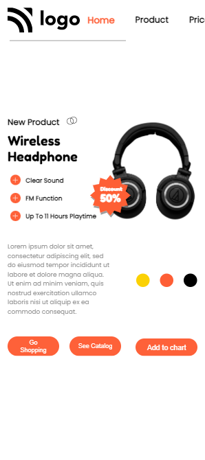

# Assignment 1

## Project 7 [Live Link](https://live-proj-7.netlify.app)

-   Skills Gained in this project
    -   Learned how we can use position **Relative** & **Absolute** in combination so that items can be stacked on top of each other
    -   Learned to add shadows onto svgs by using adobe xd

---

## Time taken to finish this project

-   3 hour taken to complete it.
-   Mobile version updated

#### Screenshot

